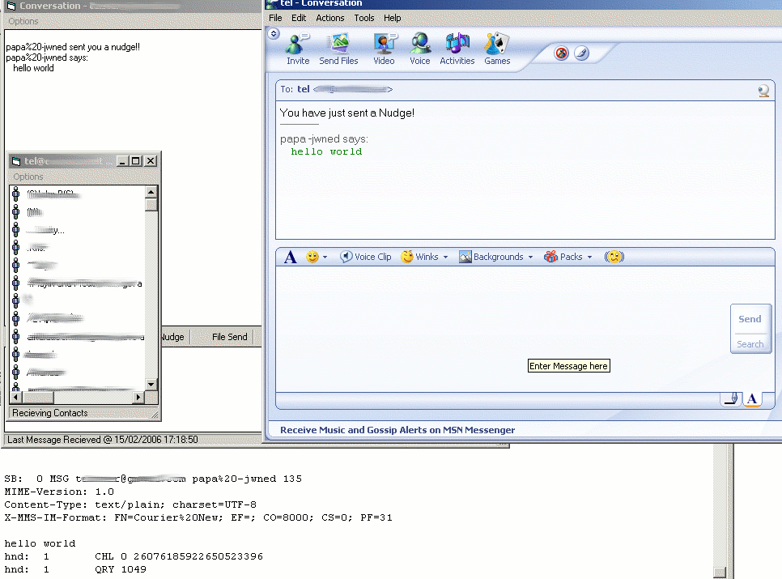



## UNFINISHED Msn Client

### Description

Msn Client. Login fine, gets the contact list etc.

Never got round to finishing, and doubt i ever will.

Might be useful for someone trying to make ther own msn client. Uses some SSL and MD5 classes/modules from PSC.
 
### More Info
 
Logs in, Grabs List, Recieves Messages, various parses for MSN Protocol

Very Unfinished, so lots of potential side effects

             |
---                |---
**Submitted On**   |2005-11-06 22:30:18
**By**             |[telly](https://github.com/Planet-Source-Code/PSCIndex/blob/master/ByAuthor/telly.md)
**Level**          |Intermediate
**User Rating**    |5.0 (15 globes from 3 users)
**Compatibility**  |VB 6\.0
**Category**       |[Internet/ HTML](https://github.com/Planet-Source-Code/PSCIndex/blob/master/ByCategory/internet-html__1-34.md)
**World**          |[Visual Basic](https://github.com/Planet-Source-Code/PSCIndex/blob/master/ByWorld/visual-basic.md)
**Archive File**   |[UNFINISHED1973372152006\.zip](https://github.com/Planet-Source-Code/telly-unfinished-msn-client__1-64338/archive/master.zip)

